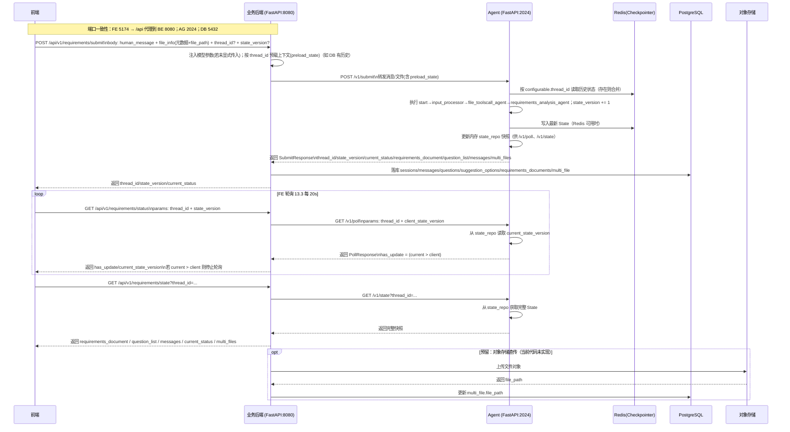

4.1 跨端交互流程
提交 human_message（13.2）→ Agent 处理 → 前端轮询（13.3）→ 拉取最新（13.4）

说明（基于当前实际实现）：
- 前端端口：5174（通过代理转发到后端 8080）；后端端口：8080；Agent 端口：2024；PostgreSQL：5432。
- FE→BE 接口：
  - 13.2 提交：POST /api/v1/requirements/submit
  - 13.3 轮询：GET /api/v1/requirements/status?thread_id=...&state_version=...
  - 13.4 获取：GET /api/v1/requirements/state?thread_id=...
- BE→AG 接口：
  - 提交：POST /v1/submit（Agent 内部：执行 LangGraph 并写入 Checkpointer 与 state_repo）
  - 轮询：GET /v1/poll?thread_id=...&client_state_version=...
  - 获取：GET /v1/state?thread_id=...
- 线程标识生成：首次若 FE/BE 未提供 thread_id，则由 Agent 在 /v1/submit 内生成并回传；后续各轮沿用该值。
- 状态存储：
  - Agent 优先使用 Redis 作为 Checkpointer（通过 REDIS_URL 或 AGENT_REDIS_URL），否则回退内存；
  - Agent 同步维护内存快照 state_repo（用于 /v1/poll 和 /v1/state）。
- 数据持久化：BE 在 submit 完成后将 Agent 返回的会话、消息、文档、问题/选项、多文件记录写入 PostgreSQL；status/state 不额外落库。
- 文件对象存储：当前代码未实现后端向对象存储的直传与回填，multi_file.file_path 由 FE 或外部上传流程产生并透传给 Agent 与 DB。

实现锚点（代码参考）：
- BE 路由：<mcfile name="requirements.py" path="backend/app/routers/requirements.py"></mcfile>
- BE→AG 客户端：<mcfile name="agent_client.py" path="backend/app/services/agent_client.py"></mcfile>
- Agent HTTP：<mcfile name="main.py" path="agent/app/main.py"></mcfile>
- 需求分析节点（state_version 递增与问题/文档产出）：<mcfile name="requirements_analysis_agent.py" path="agent/app/graph/requirements_analysis_agent.py"></mcfile>

要点回顾：
- thread_id 缺省由 Agent 在首次 /v1/submit 生成；BE/FE 后续透传。
- question_id/option_id 统一为 UUIDv4；messages 仅保留最近 1 条 user + 1 条 assistant。
- Redis 可用时使用 RedisSaver；否则使用 MemorySaver，并在 Agent 启动日志中明确指示所选 Checkpointer。
- 轮询与状态读取基于 Agent 内存 state_repo，避免频繁触达 Redis/DB，提交完成后由 BE 进行数据库持久化。