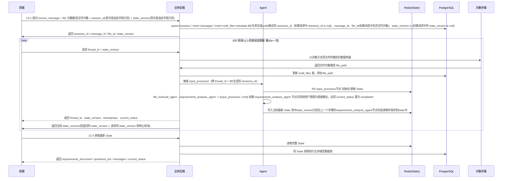

## Best Partner product design documention
提供顶层系统架构、关键流程（Mermaid 序列图）、交互逻辑详解，

—

## 1. 范围

前端页面：
登录/模型管理/需求垂询→需求确认→需求清单与需求详情 业务流程；

后台服务：

Agent：
Agent（LangGraph）多节点编排；状态与持久化；跨系统 API 协作；错误与重试；可观测性。


—

## 2. 系统关系（对两份原文的统一理解）
- 整体架构：聚焦产品与跨端联动，强调“前端（React）/后端（业务服务）/Agent（LangGraph Dev）/数据库/对象存储/图数据库/RedisSaver”的分工与流程，覆盖登录、模型管理、核心业务链路（landingpage→需求垂询→确认→清单）。
-  Agent：聚焦 Agent 内核设计与数据/状态模型，给出 State、DB 表、节点职责（start / input_processor / file_toolscall_agent / requirements_analysis_agent / end）。
- 统一关系：Best Partner的前后端是“业务外壳”，系统实现设计中的 Agent 是“智能内核”；双方通过 HTTP API 与状态存储（Redis/PG/对象存储）协同，形成一条可观测、可恢复的闭环链路。

—

## 3. 顶层系统架构设计
- Frontend（React）：
  - 登录、模型管理、需求垂询/确认/清单；
  - 支持文件元数据 + 文件（对象格式） 直传后端；
  - 通过 state_version 轮询获知 Agent 进度；
  - 无模型配置时在 landingpage 顶部提示并引导。
- Backend（FastAPI/异步优先）：
  - 统一封装  API；
  - 维护会话/消息/问卷/文档等入库（PostgreSQL）；
  - 本地对象存储落地文件原件，同时保路径与必要元数据；
  - 调用 Agent（LangGraph Dev）触发链路执行 并 负责统一管理 thread_id/state_version/message_id；
  - 适配多模型（DeepSeek/通义千问/OpenAI/腾讯混元/千川引擎/巨量引擎…），统一配置与连通性“测试→保存”。
- Agent（LangGraph）：
  - 节点链路：start → input_processor → file_toolscall_agent → requirements_analysis_agent → 条件路由（clarifying/completed）→ end；
  - RedisSaver 作为检查点存储；可接入 LangSmith 追踪；
  - 严格 JSON 输出契约，禁止幻觉字段。
  - Redis：State/检查点；
- PostgreSQL 数据存储：
  - PostgreSQL：sessions/messages/questions/suggestion_options/requirements_documents/multi_files；
  - 对象存储：文件原件；


—

## 4. 关键流程（Mermaid 序列图）

4.1 跨端交互流程
提交 human_message（13.2）→ Agent 处理 → 前端轮询（13.3）→ 拉取最新（13.4）



## 5. 交互逻辑详解
- 模型就绪性：landingpage 无可用模型配置则在顶部提示并链接到模型管理；“测试成功”前不可保存；“保存成功”后方可在业务流程使用。
- 文件上传：前端仅传元数据与对象格式的文件数据；后端落地对象存储并持久化路径/元数据；可抽取文本供 Agent 使用；
- 上下文控制：LLM 输入仅携“最近 1 对 user/assistant + 当前轮选择摘要 + 文件索引信息”；DB 保全量历史；State 以 state_version 管理增量。
- 错误与重试：LLM/文件解析失败上浮错误并支持重试；前端避免阻塞，展示“已接收，后台继续处理”。
- 可观测性：关键节点打点与 trace/span，thread_id 贯穿。用 对agent、llm调用函数及重要步骤使用 @traceable 进行修饰

—


### Agent系统详细设计
项目目录： /Users/stylesu/Documents/myproject/langchaintest/project/Best Partners/backend

使用langgraph框架开发，使用langsmith进行观测。基于langgraph最佳实践进行代码实现。


## 2. Agent Node 设计
- 2.1 start node
  - 使用后台透传的 user_id、human_message、timestamp、file_info、thread_id、state_version、message_id、current_status、model_params 初始化图
  - 初始化并更新State

- 5.2 input_processor node：
{
  "user_id": "string",
  "human_message": "string",
  "timestamp": "string",
  "file_info": [
    {
      "file_id": "string",
      "file_name": "string",
      "file_type": "string",
      "file_size": 0,
      "file_path": "string"
    }
  ],
  "thread_id": "string",
  "state_version": 0,
  "message_id": "string",
  "current_status": "string",
  "model_params": {
    "additionalProp1": {}
  }
}

    5.2.2 代码功能
        - 将 human_message 添加到 State.messages 
         - 将 file_info 添加 State.multi_files
         - interrupt 根据进入节点判断是否需要interrupt，如果是从start路由而来则不需要，如果是从requirements_analysis_agent路由而来则需要中断，并等待一轮的用户输入，即API端点收到新的请求触发事件
        


- 5.3 file_toolscall_agent：
  - 5.3.1 使用 state.messages 中最近一条 human_message 构建LLM input
  - 5.3.2 构建该节点的prompt，调用 LLM 执行  human_message + state.multi_files  ,输出工具调用指令
  - 5.3.3 解析LLM输出，提取工具调用指令
  - 5.3.4 通过MCP服务调用文件工具，提取文件内容，获得 file_content ，并将 file_content 添加到对应的 file_id 的 state.multi_files.file_content 中,同时更新对应multi_file.file_id 的 state.multi_file.message_id = 当前human_message的message_id
  - 5.3.5 判断调用指令是否全部完成，循环 5.3.4 直到所有指令完成，路由到下一个节点

  该节点通过prompt构建的能力说明：
  识别用户意图，判断是否需要提取文件内容，输出json格式的工具调用指令，指令格式如下：
  {
    "commands": [
    {
    "tool": "file_extract",
    "file_id": "文件唯一标识符",
    "file_name": "文件名",
    "file_type": "文件类型",
    "file_size": "文件大小",
    "file_path": "文件路径"
    }
    ]
  }

- 5.4 requirements_analysis_agent：
  - 5.4.1 使用 state.messages 中最近一条 human_message 及 (message_id=当前human_message的message_id 的 multi_files 中的file_name、file_content 、state.question_list 、 最新一条 state.requirements_document ) 构建LLM input
  - 5.4.2 构建该节点的prompt，调用 LLM 执行 本节点构建的 LLM input
  - 5.4.3 解析LLM输出的json
      - 5.4.3.1 提取current_status，更新state.current_status
      - 5.4.3.2 将requirements_document 替代当前state.requirements_document，并持久化存储到数据库
      - 5.4.3.3 将question_list 替代当前state.question_list，并持久化存储到数据库
      - 5.4.3.4 将current_status 替代当前state.current_status，并持久化存储到数据库。
      - 5.4.3.5 根据state.current_status 的值进行路由，如果current_status=completed，路由到end节点；如果current_status=clarifying，路由到input_processor节点。
      - 5.4.3.6 state版本管理，完成以上工作后，state版本号加1
该节点通过prompt构建的能力说明：
  -1. 通过用户输入识别用户意图
  -2. 识别用户对question_list中问题的解答或回答
  -3. 根据用户意图使用file_content中的信息
  -4. 根据 用户意图、用户question_list的解答、对file_content 进行提炼分析，基于当前requirements_document之上，进行需求分析、总结、更新
  -5. 根据 步骤4 更新后的requirements_document，提出3个问题，并为每个问题添加3个建议选项。提问要遵循由浅入深，循序渐进原则。给出的建议选项要符合问题当下的最佳实践。
  -6. 识别用户直接输出、强制停止询问的意图，识别到需要输出current_status=completed
  -7. 输出标准的json格式，json schema如下：
  {
    "current_status": "clarifying/completed",  #  Clarifying: 澄清中; Completed: 完成，默认为Clarifying
    "requirements_document": {
      "version": "1.0",
      "content": "更新后的需求文档内容",
      "last_updated": "2023-10-15",
    }
    question_list: {
      "question_id": "问题唯一标识（UUID6格式）",
      "content": "问题内容文本",
      "suggestion_options": [
        {
          "option_id": "选项唯一标识",
          "content": "选项内容文本",
          "selected": true
        }
      ]
    }
  }

- 5.5 end

## 6. 提示词
requirements_analysis_agent prompt：
- 问题生成规则：
  1) 数量与层次：每轮固定3题；由浅入深、循序渐进；避免一次性穷举。
  2) 结合文件：若本轮包含文件内容，问题需引用片段要点并追问其约束与取舍。
  3) 建议选项：建议选项需要结合问题在当下的最佳实践；选项措辞清晰；默认 selected=false。

- 稳健性与格式：
  1) 仅输出 JSON，不得混入自然语言或 Markdown；如需对用户说明，填入 user_message 字段。
  2) JSON 键名与类型必须与 Schema 一致；不可缺字段，不可额外扩展未约定字段。
  3) 失败兜底：如无法解析输入或上下文不足，输出 clarifying，给出能拉起下一轮的信息需求型问题。
- 迭代与路由契合：
  1) 完成态 current_status=completed → end；澄清态 clarifying → 回到 input_processor。
  2) 生成问题的同时必须同步更新 requirements_document，使之反映用户已明确回答的问题。


## 7. 流程与路由（LangGraph 规划）

- start → input_processor → file_toolscall_agent → requirements_analysis_agent → 条件路由（强制输出） → end/迭代
- 人在回路：在 input_processor 前设置 interrupt_before，由上层API恢复


## 12.State设计
 遵循langgraph的最佳实践
 使用RedisSaver进行存储
SuggestionOption(TypedDict):
    """建议选项结构"""
    option_id: str  # 选项唯一标识
    content: str  # 选项内容文本
    selected: bool  # 是否被用户选择

Question(TypedDict):
    """问题结构"""
    question_id: str  # 问题唯一标识（UUID6格式）
    content: str  # 问题内容文本
    suggestion_options: List[SuggestionOption]  # 建议选项列表

RequirementsDocument(TypedDict):
    """需求文档结构"""
    version: str  # 文档版本号
    content: str  # 需求文档内容文本
    last_updated: str  # 文档最后更新时间

ValidationState(TypedDict):
    # 会话标识
    thread_id: str  # 会话唯一标识符
    state_version: int  # 状态版本号，管理当前state版本信息
   
Message(TypedDict)
    message_id: str  # uuid6消息唯一标识符
    message_role: str  # 消息角色：user/assistant/system
    message_content: str  # 消息内容
    timestamp: str  # 消息时间戳
    
FileInfo(TypedDict):
    """文件信息结构"""
    file_id: str  # 文件唯一标识符
    message_id: str  # 对应的消息
    file_name: str  # 文件名
    file_type: str  # 文件类型
    file_content: str  # 文件内容
    file_path: str  # 文件路径

    # 问题清单
    questions_list: List[Question]  # 需要澄清的问题列表
    
    # 需求文档
    requirements_document: Optional[RequirementsDocument]  # 需求文档内容

    # 多文件信息
    multi_files: List[FileInfo] 
    
    # 会话元数据
    created_at: str  # 创建时间
    updated_at: str  # 更新时间
    current_status: str  # 当前状态：clarifying/completed


### Backend 设计方案


## 12.PostgreSQL 设计
    12.1 sessions 表（会话表）
    存储会话基本信息

    字段名	类型	约束	描述
    thread_id	UUID	PRIMARY KEY	会话唯一标识符
    created_at	TIMESTAMP WITH TIME ZONE	NOT NULL DEFAULT NOW()	创建时间
    updated_at	TIMESTAMP WITH TIME ZONE	NOT NULL DEFAULT NOW()	更新时间
    current_status	VARCHAR(20)	NOT NULL DEFAULT 'clarifying'	当前状态

    12.2. messages 表（消息表）
    存储对话消息历史

    字段名	类型	约束	描述
    message_id	UUID	PRIMARY KEY	消息唯一标识符
    thread_id	UUID	FOREIGN KEY REFERENCES sessions(thread_id)	所属会话ID
    role	VARCHAR(10)	NOT NULL	消息角色：user/assistant/system
    content	TEXT	NOT NULL	消息内容
    timestamp	TIMESTAMP WITH TIME ZONE	NOT NULL DEFAULT NOW()	时间戳
    metadata	JSONB	NULL	附加元数据

    12.3. questions 表（问题表）
    存储需要澄清的问题

    字段名	类型	约束	描述
    question_id	UUID	PRIMARY KEY	问题唯一标识
    thread_id	UUID	FOREIGN KEY REFERENCES sessions(thread_id)	所属会话ID
    content	TEXT	NOT NULL	问题内容
    created_at	TIMESTAMP WITH TIME ZONE	NOT NULL DEFAULT NOW()	创建时间

    12.4. suggestion_options 表（建议选项表）
    存储问题的建议选项

    字段名	类型	约束	描述
    option_id	UUID	PRIMARY KEY	选项唯一标识
    question_id	UUID	FOREIGN KEY REFERENCES questions(question_id)	所属问题ID
    content	TEXT	NOT NULL	选项内容
    selected	BOOLEAN	NOT NULL DEFAULT FALSE	是否被选择

    12.5. requirements_documents 表（需求文档表）
    存储需求文档及其版本历史

    字段名	类型	约束	描述
    document_id	UUID	PRIMARY KEY	文档唯一标识
    thread_id	UUID	FOREIGN KEY REFERENCES sessions(thread_id)	所属会话ID
    version	VARCHAR(20)	NOT NULL	文档版本号
    content	TEXT	NOT NULL	文档内容
    created_at	TIMESTAMP WITH TIME ZONE	NOT NULL DEFAULT NOW()	创建时间
    current_status	VARCHAR(20)	NOT NULL DEFAULT 'clarifying'	当前状态 / completed

    12.6 multi_file 表
    存储会话中的多文件信息
    字段名	类型	约束	描述
    file_id	UUID	PRIMARY KEY	文件唯一标识
    message_id	UUID	NOT NULL	对应的消息id
    thread_id	UUID	FOREIGN KEY REFERENCES sessions(thread_id)	所属会话ID
    file_name	TEXT	NOT NULL	文件名
    file_type	TEXT	NOT NULL	文件类型
    file_content	TEXT	NULL	文件内容 
    file_path	TEXT	NULL	文件路径
    created_at	TIMESTAMP WITH TIME ZONE	NOT NULL DEFAULT NOW()	创建时间  

    12.7 model_params 表
    存储模型参数

    字段名	类型	约束	描述
    model_id	UUID	PRIMARY KEY	模型唯一标识
    user_id	UUID	NOT NULL	用户唯一标识
    provider	TEXT	NOT NULL	模型供应商
    temperature	DOUBLE PRECISION	NULL	温度参数
    api_key	TEXT	NULL	模型供应商 api_key
    base_url	TEXT	NULL	模型供应商 api_base_url
    max_token INTEGER	NULL	最大 token 数

@sushang v1.1 API 详细设计（v1.1）
- 通用约定：
  - Base URL: https://api.best-partner.local 或部署实际域名
  - 认证：Authorization: Bearer <token>（用于应用鉴权）；模型供应商 api_key 不落日志、不回显，仅用于后端直连模型。
  - 追踪：必传 X-Trace-Id（可由前端生成）；服务内部贯穿 thread_id；所有请求写入可观测链路。
  - 编码：UTF-8；Content-Type: application/json
  - 错误模型：
    {
      "error": { "code": "string", "message": "string", "details": {}} 
    }

1) 13.1 LangSmith 可观测性配置与接口

- LangSmith 配置
  ```python
  # 环境变量配置
  LANGCHAIN_TRACING_V2=true
  LANGCHAIN_ENDPOINT="https://api.smith.langchain.com" 
  LANGCHAIN_API_KEY="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"
  LANGCHAIN_PROJECT="requirements-validation"  # 项目名称
  ```

- LangGraph Studio 接入
  ```python
  from langsmith import Client
  from langgraph.prebuilt import ToolExecutor
  
  # 初始化 LangSmith client
  client = Client()
  
  # 工作流追踪装饰器
  @traceable(name="requirements_validation_graph")
  def create_requirements_graph():
      # 构建工作流...
      return graph
  
  # 节点追踪装饰器 
  @traceable(name="input_processor")
  def input_processor(state):
      # 节点逻辑...
      return state
  ```

- 可观测端点
  - Endpoint: POST /assistant/trace
  - 描述：面向 LangSmith 的可观测性入口,支持工作流追踪、节点监控、LLM 调用分析
  - Request:
    ```json
    {
      "thread_id": "UUID",
      "trace_id": "string", 
      "run_id": "string",
      "metadata": {
        "user_id": "string",
        "session_type": "string"
      }
    }
    ```
  - Response:
    ```json
    {
      "trace_url": "https://smith.langchain.com/traces/{trace_id}",
      "metrics": {
        "total_tokens": 1234,
        "completion_tokens": 567,
        "latency_ms": 890
      },
      "node_traces": [
        {
          "node_id": "input_processor",
          "start_time": "2024-03-21T10:00:00Z",
          "end_time": "2024-03-21T10:00:01Z",
          "status": "success"
        }
      ]
    }
    ```

- 追踪数据
  - 工作流执行路径与状态
  - 节点执行时间与结果
  - LLM 调用参数与响应
  - 工具调用与错误信息
  - 自定义指标与元数据

- 可视化
  - LangGraph Studio 中查看 DAG 流程图
  - 节点执行热力图
  - LLM 调用统计
  - 错误分布分析
- Endpoint: POST /assistant
- 描述：面向统一对话编排的入口，接收一轮用户输入（文本+可选文件元信息与文件内容），驱动 graph 完成 file_toolscall → requirements_analysis 一次迭代。
- Request
  {
    "thread_id": "UUID，必填。",
    “state_version”: "INT 必填"。
    "human_message": "string",
    "file_info": [{ "file_id": "UUID", "file_name": "string", "file_type": "string", "file_path": "string?", "content": "string" }],
    "model_config": { "provider": "qwen|deepseek|…", "model": "string", "temperature": 0.0, "base_url": "string", "api_key": "string" },
    "current_status": "clarifying|completed"
  }
- Response 200
  {
    "thread_id": "UUID",
    "state_version": 1,
    "current_status": "clarifying|completed",
    "requirements_document": { "version": "1.1", "content": "...", "last_updated": "2025-..-.." },
    "question_list": [ { "question_id": "...", "content": "...", "suggestion_options": [ {"option_id": "...","content": "...","selected": false} ] } ],
    "user_message": "用于 UI 展示的说明"
  }
- 状态码：201（首次创建会话）、200（正常）、400（参数错误）、401/403（鉴权）、429（限流）、500（内部错误）
- 语义：当 force_complete=true 或 human_message≈“直接输出”时，后端传递直出意图给 LLM，期望 current_status=completed。

2) 13.2 发送 human message/文件的接口（面向“最佳拍档.md”场景）
- Endpoint: POST /assistant/human-message
- 描述：核心交互端点，负责触发 LangGraph 项目执行并启动一轮对话。该接口接收用户输入与文件，使用当前选中模型进行处理，并返回对话结果。

- Request
  {
    "user_id": "string",
    "thread_id": "string",
    "state_version": "int",
    "human_message": "string",
    "timestamp": "ISO-8601",
    "file_info": [{ "file_id": "UUID", "file_name": "string", "file_type": "string", "file_size": 12345, "file_path": "oss://...", "content": "string" }]
  }
- Response 200
  {
    "thread_id": "UUID",
    "state_version": 13,
    "current_status": "clarifying|completed",
    "requirements_document": { ... },
    "question_list": [ ... ]
  }
- 规则：
  - 若用户未配置可用模型，返回 409 CONFLICT，并在 message 中引导前往“模型管理”。

3) 13.3 获取 state 指定版本
- Endpoint: GET /state
- Query: thread_id=UUID&state_version=int
- Response 200
  { "thread_id": "UUID", "state_version": 11 }
- 语义：仅用于轻量探测；如需全量，请用 13.4。

4) 13.4 获取 state 当前版本（全量）
- Endpoint: GET /state/current
- Query: thread_id=UUID
- Response 200
  {
    "thread_id": "UUID",
    "state_version": 15, // state_version 由 requirements_analysis_agent 节点在更新 state 后自增，每次 +1
    "current_status": "clarifying|completed",
    "requirements_document": { ... },
    "question_list": [ ... ],
    "messages": [ ... ] // 可配置是否返回
  }
- Error Response:
  - 404: thread_id 不存在
  - 500: Redis 读取失败，可重试
- Endpoint: GET /state/latest
- Query: thread_id=UUID
- Response 200
  {
    "thread_id": "UUID",
    "state_version": 15,
    "current_status": "clarifying|completed",
    "requirements_document": { ... },
    "question_list": [ ... ],
    "messages": [ ... ] // 可配置是否返回
  }

- 校验与限流：所有写入类端点（13.1/13.2）启用幂等键 Idempotency-Key；单用户 QPS 默认 10；附件单次 ≤ 3MB（后端可配置）。
- 可观测性：所有端点写入 trace/span，携带 thread_id 与 X-Trace-Id。
- 安全：不持久化明文 api_key，不回显；敏感字段脱敏日志；上传走对象存储直传或分片。


### Frontend 设计

## 产品名称：最佳拍档
## 产品功能：
    1、 需求垂询：用户输入简单需求，包括语言描述、文件上传，点击提交后，AI返回消息，用户可以根据消息进行需求确认
    2、 需求确认：用户根据AI返回的消息，进行需求确认，确认后，用户可以查看需求清单
    3、 需求清单：用户可以查看所有已确认的需求，包括需求概述（使用用户在landingpage输入的信息）、确认时间、（详情、编辑、删除）按钮
    4、 用户登录：登陆、注册（先不实现注册页面，但显示这个功能按钮），提供默认用户 user='sushang'  password='123456'
    5、 模型管理：用户可以添加模型配置，并选择使用的模型
    6、 多租户：每个用户有在平台上使用各功能产生的私有数据，不同用户之间的数据是隔离的。

## 设计规范
- 颜色：
  - 基础：#000000（主文本/重黑）、#111111/#1D1D1F（深灰背景层）、#F5F5F7（浅灰背景层）、#FFFFFF（面板底色）
  - 强调：#0071E3（互动蓝，按钮/链接）、#34C759（成功）、#FF3B30（错误）、#FF9F0A（警示）
  - 阴影：rgba(0,0,0,0.06) 微阴影，仅用于浮层/卡片悬停
- 字体：SF Pro Text / SF Pro Display，中文回退苹方；字号层级 12/14/16/20/24/28，正文 14/16；行高 1.5
- 栅格与宽度：桌面 1200px 容器（max-width），内容区 12 栅格，边距 24/32 间距体系（4/8/12/16/24/32/48）
- 圆角与动效：圆角 10；动效曲线 cubic-bezier(0.25, 0.1, 0.25, 1) 150–240ms，进场淡入+轻微上移

- 页面布局：
- 全局：顶栏 TopNav（左 LOGO/产品名，中导航，右用户与模型指示）；内容区；极简页脚（版权/版本）
- 页面：
  - 登录 Login：居中卡片（宽 420），账号/密码/登录按钮；错误内联提示；示例账户文案
  - Landing：居中输入卡片（需求文本+上传），居中“提交”按钮；顶栏消息条在未配置模型时提示跳转模型管理
  - 模型管理 Models：卡片式列表+“新建模型”抽屉；卡片显示供应商/模型/温度/token；单选“当前使用”
  - 需求垂询 Clarify：左侧对话与问卷、右侧需求文档实时区（不可编辑）；顶部显示 state_version
  - 需求确认 Review：大幅 Markdown 渲染 + 认可/不认可与反馈输入
  - 需求清单 List：表格/卡片式列表，支持筛选/排序/分页；详情/编辑/删除

- 页面元素与关键交互
- 按钮：主按钮蓝色填充（#0071E3）、次按钮描边灰、文字链接；禁用态 60% 不透明
- 输入：
  - 文本框/文本域：浅灰边 #D2D2D7，聚焦蓝色描边；支持字数统计与粘贴图片转附件
  - 下拉/单选/复选：遵循原生风格加强可用性，触控目标≥44px
- 上传：支持拖拽/点击；显示队列、进度、取消；超大文件分片直传到 OSS，返回 file_id 与路径

- 需求垂询页核心流：
  1) 问题区：按 Q1/Q2/Q3 展示；每题渲染建议选项（多选）+“根据最佳实践给我建议”固定选项+自由输入；“无需关心此问题”置灰该题
  2) 提交：点击“提交”
     - 前端整合 payload：human_message（文本+所选选项+自由输入的摘要）、file_info（已上传文件的元数据+对象格式的文件）
     - 调用 13.2 /assistant/human-message；若响应 current_status=clarifying：刷新问卷；若=completed：跳转“需求确认”
     - 加入 X-Trace-Id 与 thread_id（首次从响应获取并保存）
  3) 直接输出：点击后仅发送 human_message="直接输出" 或 force_complete=true 调用 13.2；后端期望 LLM 输出 completed
  4) 需求文档区：右侧实时渲染 requirements_document.content；每轮更新以淡入高亮最近差异


- 模型管理：
  - 新建/编辑模型：供应商/模型/base_url/api_key/温度/max_tokens；“测试连接”调用后端 health 校验；成功后方可“保存”
  - 列表单选“正在使用”：切换即更新用户配置，后端持久化

- 需求确认：
  - 认可：写后端确认记录（可归档需求），跳转清单
  - 不认可：要求输入原因并提交；调用 13.2 进入新一轮澄清


- 清单与详情：
  - 清单：概要、确认时间、操作（详情/编辑/删除）
  - 详情：展示最终说明与关联的问题/答案快照

- 响应式
- 断点：≥1200 桌面；768–1199 平板；<768 移动
- 布局：
  - 桌面：左右双栏（垂询页）；
  - 平板：上下折叠（问题在上、文档在下）；
  - 移动：优先问题，文档折叠为“查看当前需求”抽屉
- 字号与间距随断点线性缩放；图片根据 DPR 自适应；触控目标≥44px


用户流程：
登录 -> landingpage -> 需求垂询 -> 需求确认 -> 需求清单
1、登陆，仅实现登录功能，不实现注册流程，默认提供user='sushang'  password='123456' 登陆
2、模型管理,通过top区域菜单进入模型管理页面
    2.1 模型管理：用户可以添加模型配置
        2.1.1 模型供应商选择：可选 Deepseek、通义千问、OpenAI
        2.1.2 base_url配置：将模型的base_url地址配置到系统中
        2.1.3 api_key配置：将模型的api_key配置到系统中
        2.1.4 model配置：将模型的model参数配置到系统中
        2.1.5 模型温度设置：0～1的数字区间，默认0.1，用户可以通过拉动控件或输入进行调整
        2.1.6 模型最大token设置：默认2048，用户可以通过输入进行调整
        2.1.7 '测试'按钮：用户点击测试来对当前配置的连通性进行测试，测试结果展示在当前配置窗口下方
        2.1.8 '保存'按钮：用户点击保存将当前配置保存下来，必须测试成功后才能保存，否则不可用
        2.1.9 '取消'按钮：用户点击后关闭当前配置窗口，并不保存当前配置
    2.2 模型列表
        2.1.1 已配置模型通过卡片列表的方式展示，展示模型供应商、模型温度、最大token、model参数
        2.1.2 模型选择，必须有且只能有一个被使用的模型，处于被选择状态。默认选择用户配置的第一个模型。用户可以点击卡片进行切换。系统将保存用户选择模型信息，并在后续请求LLM时使用当前选择模型的信息来构建请求体。
3、需求垂询、需求确认、需求清单见下方说明


核心使用流程：
landingpage -> 需求垂询 -> [当用户点击'认可' -> 需求清单| else -> 需求垂询]
1、landingpage，用户登录后进入landingpage：
    1.1、 输入简单需求，包括语言描述、文件上传。文件上传需要将文件元数据(文件名、文件类型、文件大小)上传至后端，并将文件以对象的格式传输至后端。
    1.2、 提交（按回车、点击提交按钮）
    1.3、 进入landingpage后需要判断当前用户下是否有可用模型，如果没有需要在top区域下一个消息条来提示用户需要配置模型，如：
    ‘您必须配置模型后才能使用功能，模型配置’ 其中模型配置是一个链接，点击后跳转至模型管理页面

2、需求垂询（
    2.1、 当前轮次序号，使用state_version
    2.2、 AI message，AI 返回的消息
    2.3、 问卷清单（由AI message的问题列表、可选项列表组成）
        2.3.1 问题列表,Q1、Q2……
        2.3.2 每个问题下的用户选项（包括对AI message解析出的可选择内容、提供的快捷回复选项、用户输入窗口）。
              2.3.2.1、 AI提供的建议解析出的可选项（可多选，建议可能有多个，用户可以根据自己的需求选择），AI选项数量数量不定，需要动态渲染
              2.3.2.2、 固定选项 = '根据最佳实践给我建议'
              2.3.2.3、 用户输入，在前端提供用户输入的表单项，可输入文本内容
              2.3.2.4、 固定按钮 = '无需关心此问题'
    2.4   用户输入：为用户提供文本输入与文件上传功能，文件上传需要将文件元数据(文件名、文件类型、文件大小)上传至后端，并将文件内容以对象的格式传输至后端。
    2.5、 '提交'按钮：点击后将当前用户对问题列表(question_list)的选择与输入内容打包为 content 并提交至后端，后端返回消息后继续进入下一轮需求垂询。提交的 content :
    将以下内容拼装为一条 content，并作为 human_message 的content  通过API 提交至后端
        {
          "question_id": "q1.question_list.question_id",
          "selected_contents": ["question_id.suggestion_options.A.content", "question_id.suggestion_options.B.content"]
        },
        {
          "question_id": "q2.question_list.question_id", 
          "selected_contents": ["根据最佳实践给我建议"]
        },
        {
          "question_id": "q3.question_list.question_id",
          "user_input": "做成一个文档"
        }
  
    ```
    2.6、 ‘认可方案’按钮：点击后 忽略当前页面问题表单的选项与用户输入内容，直接仅将 ‘直接输出’ 以content 提交至后端 ，后端返回消息后跳转至需求确认页面。位于 当前需求文档 下方

    2.7、 当前需求文档 显示部分，后端返回的当前需求文档持续显示在页面右侧，每轮垂询后都会更新里面的内容

3、需求清单    
    3.1 需求列表，展示所有current_status='completed' 的需求，以thread_id为唯一编号，包括需求概述（使用用户在landingpage输入的信息）、确认时间、（详情、编辑、删除）按钮。数据来自 数据库的 requirements_documents 表 ，通过thread_id 获取 current_status='completed' 的数据
    3.2 每条需求，包含 需求概述 通过thread_id 获取message表中最早一条数据的content，需求描述 content字段 、确认时间  created_at 字段、操作按钮（详情、编辑、删除）
    3.3 操作按钮
        3.3.1 详情：点击后展示需求的详细信息，包括需求概述、文档版本号、需求描述、确认时间
        3.3.2 需求时间轴：文档右侧通过thread_id查询requirements_documents 的所有数据的 version，排列形成列表，用户可以点击一个version将详情跳转到该版本的需求详情


###  Backend设计说明
 best-partners-api（FastAPI）

